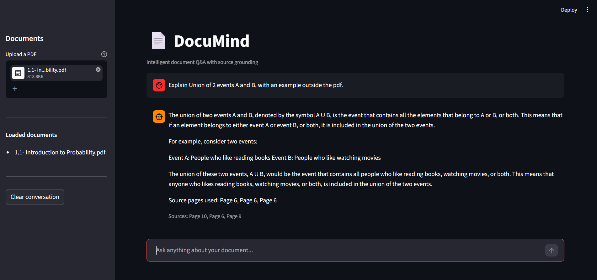

# DocuMind — Intelligent Document Q&A

Ask natural language questions across your PDF documents.
Get precise answers grounded in source pages — no hallucination.

## Demo


## Architecture
PDF Upload → Text Chunking → Sentence Embeddings → ChromaDB
→ Semantic Retrieval → Groq LLaMA 3.1 → Cited Answer

## Stack
Python · LangChain · ChromaDB · Groq API · FastAPI · Streamlit

## Run locally
```bash
git clone https://github.com/shamlanazar/Documind
cd documind
python -m venv venv && venv\Scripts\activate
pip install -r requirements.txt
cp .env.example .env  # add your GROQ_API_KEY
python server.py      # terminal 1
streamlit run app.py  # terminal 2
```

## API
POST /api/v1/upload  — ingest a PDF
POST /api/v1/ask     — ask a question
GET  /api/v1/health  — health check